# Phase 0 — Repo Recon (Orders experience)

Scope: the `manage-orders` fulfilment console. No opinions here — facts + citations.
All paths relative to repo root. Line numbers from the working tree at time of writing.

---

## 1. Screen & component inventory

Everything renders from **one** 11,519-line client file: `src/app/manage-orders/page.js`.
Sub-components are declared inline in that same file (not separate modules).

| Component | File:line | Responsibility | Rendered by | LOC (approx) |
|---|---|---|---|---|
| `ManageOrdersPage` | `src/app/manage-orders/page.js:2742` | Root: tabs (Analytics/Orders/Users/Track/Tracking), header, search, filters, stats, order list, cards, all mutations | route `/manage-orders` | ~8,780 |
| `Accordion` | `page.js:1647` | Collapsible section shell (`Orders`, `Stats`) | ManageOrdersPage | ~39 |
| `IndiaPostSheet` | `page.js:1225` | "Book online" courier-booking modal | ManageOrdersPage (via `bookOrder`) | ~420 |
| `IpField` / `IpTruckRail` | `page.js:1165` / `1195` | Packing field + progress rail inside booking sheet | IndiaPostSheet | ~30 / ~30 |
| `WalletModal` | `page.js:549` | Admin wallet adjust (Users tab) | ManageOrdersPage | ~155 |
| `OrdersLoader` | `page.js:1686` | Skeleton loader | ManageOrdersPage | ~22 |
| `OrdersCalendar` | `page.js:793` | Day-count calendar filter (Analytics) | ManageOrdersPage | ~156 |
| `ProfitCostChart`/`RunRateChart`/`WeeklyBarChart`/`PredictedMRR`/`DailyVolumeChart` | `page.js:1709/2135/2396/2549/975` | Analytics charts | ManageOrdersPage | — |
| `CalculatorModal` | `page.js:2613` | Kebab calculator | ManageOrdersPage | ~129 |

Supporting modules used by the order flow:

| Module | File:line | Used for |
|---|---|---|
| `updateOrderRow` (server-proxied) | `src/utils/googleFormOrder.js:89` | **NOT used by this screen** — manage-orders defines its own (see below) |
| `getBookCost` | `src/data/bookCosts.js` | cost → margin math (`orderEconomics`, `page.js:486`) |
| `getDeliveryCharge` | `src/utils/cartOffers.js` | India Post cost estimate |
| shipping/label canvas | `src/utils/shippingForms.js` | Book-online sheet + address labels |
| `openWhatsApp` | `page.js:102` | build `wa.me` deep link |

> **Finding (evidence):** this screen has a **local** `updateOrderRow` at `page.js:5338`
> that bypasses the secured server route and calls the Apps Script `/exec` URL directly
> from the browser (`SHEET_EDIT_API_URL`, `page.js:273`) with `mode: "no-cors"`. The
> hardened server path (`/api/order-write` via `googleFormOrder.js:89`) is imported but
> only `creditWalletReward, appendWalletTx` are pulled in (`page.js:81`); order status /
> tracking / comment / delete / edit all go client-side no-cors.

---

## 2. State model (as it actually exists)

Every flag an order can carry, where it lives, who mutates it:

| State | Values | Stored where | Mutated by (UI) | Persisted? | Derived? |
|---|---|---|---|---|---|
| Order status | free-ish list `TRACK_STATUS_OPTIONS` (Pending, Processing, Getting Shipped, In transit, Out for delivery, Delivered, Cancelled…) | Sheet col `Order Status` | collapsed-card `<select>` (`page.js:8896`), expanded status select, bulk push | Sheet (via local `updateOrderRow`, no-cors) | persisted |
| Pending status (queued) | `{ orderId: status }` | React `pendingStatus` (`page.js:3237`) | same selects; pushed by `pushPendingStatus` (`page.js:3372`) | in-memory only | derived buffer |
| Pick state (per book) | `{ "orderId::idx": true }` | React `pickChecked` (`page.js:2797`) **+ localStorage `manage_orders_picks`** (`page.js:3739/3751`) | tap a cover `toggleBook` (`page.js:3770`) | **device-local only — never written to Sheet** | persisted (local) |
| Packed | boolean per order | `packedOrders` (localStorage) | "Mark as packed" (`page.js:9569`, `10525`) | device-local | persisted (local) |
| Confirmed / unconfirmed | derived from name containing `(unconfirmed)` | Sheet col `Customer Name` | order confirm flow elsewhere; regex tests at `page.js:3993, 4414` | Sheet | **derived from a string** |
| Payment mode | COD / UPI / WhatsApp | Sheet col `Payment Type` | — (read only here) | Sheet | derived (`isCOD` regex) |
| Courier booked | boolean per order (+ tracking) | `bookedOrders` (localStorage, `page.js:2881/2889`) | Book-online sheet | device-local | persisted (local) |
| Tracking / Shipping ID | string | Sheet col `Shipping ID` | inline "Add tracking ID" input → `saveTrackingId` (`page.js:5377`) | Sheet (no-cors) | persisted |
| Comment (operator) | string | Sheet col `Comment` | Comment button → note editor (`page.js:3006`) | Sheet (no-cors) | persisted |
| Customer note | string | Sheet col `Order Comment` | read-only here | Sheet | persisted |

**Key structural facts**
- Pick + packed + booked live **only on the operator's device** (localStorage). A second
  device, a cache clear, or a different browser shows a blank pick/pack/book state while
  the Sheet says the order is "Delivered". (evidence: `page.js:2797, 3739, 2881`)
- Order status changes are **queued in memory** then batch-pushed; nothing persists until
  the operator taps Push (`pushPendingStatus`, `page.js:3372`). Navigating away loses the
  queue.
- "Confirmed" is not a field — it is inferred from the literal substring `(unconfirmed)`
  in the customer name (`page.js:4414`).

---

## 3. Real state machine (incl. illegal-but-reachable states)

```mermaid
stateDiagram-v2
    [*] --> Unconfirmed: name contains "(unconfirmed)"
    [*] --> Confirmed: name clean

    Unconfirmed --> Confirmed: (external confirm flow)

    state "Order Status (Sheet)" as S {
        Pending --> Processing
        Processing --> GettingShipped
        GettingShipped --> InTransit
        InTransit --> OutForDelivery
        OutForDelivery --> Delivered
        Pending --> Cancelled
        Processing --> Cancelled
        Delivered --> Pending: %% ILLEGAL: dropdown allows any→any
        Cancelled --> InTransit: %% ILLEGAL: no guard
    }

    note right of S
      Status is a free <select> of all options.
      Any value → any value, no legal-transition guard.
      (page.js:8896)
    end note
```

**Illegal / inconsistent states the UI currently permits (highest-value findings):**

| # | Illegal state reachable | Why | Evidence |
|---|---|---|---|
| A | `Order Status = Delivered` while `pickChecked = 0/N` (nothing picked) | pick and status are independent; no gate | `page.js:2797` vs `8896` |
| B | `Cancelled` order still shows Book-online / WhatsApp / status push as normal | no terminal-state lockout | card actions `page.js:9107+` |
| C | Status set to any value regardless of current (e.g. `Delivered → Pending`) | bare `<select>`, no transition validation | `page.js:8911` |
| D | Ship at negative margin (e.g. `−₹152`) — displayed, never blocked | margin is display-only | `pnl` set at `page.js:3809`, no guard on Book-online |
| E | `Packed`/`Booked = true` locally but Sheet status still `Pending` | packed/booked are localStorage, status is Sheet | `page.js:2881` vs status write |
| F | Duplicate WhatsApp send / duplicate status push | `openWhatsApp` just opens a link every tap; no idempotency/sent-state | `page.js:102` |

---

## 4. Data contract (order object)

Built in `fetchOrders` (`page.js:3824`) from a gviz read of the whole sheet.
Raw Sheet columns consumed: `Order ID, Customer Name, Phone Number, Address, City, State,
Pincode, Books List, Total Amount, Payment Type, Delivery Type, Order Status, Shipping ID,
Comment, Order Comment, Gift Wrap, Timestamp / Timestamp(D)`.

Derived fields added at fetch (`page.js:3796–3809`):
`parsedBooks[]`, `shippingId`, `status`, `revenue`, `booksCost`, `weight`, `deliveryCost`,
`totalCost`, `pnl`, `_rowIndex`.

| Field | Shown | Truncated | Hidden | Derived |
|---|---|---|---|---|
| Customer Name | yes (header) | **yes** (`…`) | — | — |
| Order ID | yes | **yes** (`ORD…895`, last-3 coloured) | — | — |
| revenue / cost / profit | yes (expanded, 3 stacked cards) | no | — | cost+profit derived from catalogue, not Sheet |
| Delivery Type | yes (courier line) | — | — | `cleanDeliveryType` helper exists (`page.js:115`) but the expanded courier line still shows `Standard Delivery (Standard Delivery)` → **EVIDENCE: partial** (helper defined; not confirmed applied to that render) |
| Address + maps URL | yes (raw free text w/ inline URL) | — | — | not parsed into structured fields |

---

## 5. Interaction audit (primary tappables)

| Element | Does | Labelled? | Target | Confirms? | Undo? | Idempotent? | Evidence |
|---|---|---|---|---|---|---|---|
| Status `<select>` (collapsed) | queues status change | via `title` | full-width-ish | no | no (queued, Discard exists) | n/a | `page.js:8896` |
| Delete (trash) | permanent Sheet row delete | icon-only + `title` | small, beside WhatsApp | **`window.confirm`** | **no** | no (fire-and-forget no-cors) | `page.js:5441` |
| WhatsApp | opens `wa.me` link | icon-only | ~38px | no | n/a | **no — every tap re-opens** | `page.js:102`, `8984` |
| Book cover | toggle pick (local) | `title`=book name | ~cover | no | tap again | yes | `page.js:3770` |
| Copy phone / order | clipboard | icon-only + `title` | ~small | no | n/a | yes | `page.js:8828/8858` |
| View link | opens customer order page | text | ok | no | n/a | yes | `page.js:8873` |
| Add tracking ID → Save | writes `Shipping ID` | Save button reads low-contrast/amber | ok | no | no | no (no-cors) | `page.js:5377` |
| Mark as packed | local packed flag | text | ok | no | toggle | yes (local) | `page.js:9569` |
| Book online | opens IndiaPostSheet | text | ok | n/a | n/a | opens modal | `page.js:9149` |
| Status push / discard | batch write / reset | text | ok | no | Discard | no | `page.js:3372/3392` |

---

## 6. Perf & resilience baseline

| Concern | Reality | Evidence |
|---|---|---|
| Data load | **entire sheet** fetched client-side via gviz, parsed in JS; no server pagination | `page.js:3824`, `SHEET_API_URL:260` |
| Render volume | client slice `visibleOrders = listOrders.slice(0, ordersVisible)`, `ORDERS_BATCH = 10` (`page.js:5888/2761`); grows on scroll (IntersectionObserver `page.js:6054`) **and** a "Load more" button (`page.js:9726`) — two mechanisms | — |
| List virtualisation | **none** (plain map of sliced array) | `page.js:9xxx` |
| Book cover images | ``, no width/height/`sizes`, no placeholder | `page.js:9031` |
| Failed mutation | **cannot be detected** — all writes are `mode:"no-cors"` fire-and-forget; UI updates optimistically then `setTimeout(fetchOrders, 1300)` | `page.js:5344, 5457, 3387` |
| Offline | no offline/queue/blocking model; write silently no-ops | — |
| Double-tap | not guarded (WhatsApp, push, delete can all fire twice) | — |
| Empty / loading / error states | `OrdersLoader` skeleton exists; **no error / offline / partial-failure UI** | `page.js:1686` |
| Secret exposure | Apps Script `/exec` URL + Sheet ID shipped in client bundle | `page.js:260, 273` |

---

## 7. Blocking questions (≤7) — answer these and I proceed to Phase 1

1. **Source of truth for pick/pack/booked:** these are localStorage-only today. Is it
   acceptable that a second device / cache-clear loses all pick-pack-book progress, or must
   these move to the Sheet (needs new columns + write path)? This changes the whole IA.
2. **Write path:** are you willing to route the admin writes through the existing hardened
   `/api/order-write` server route (so failures are detectable and the `/exec` URL leaves
   the browser bundle), or must I keep the client-side `no-cors` writes for now?
3. **Status model:** should I impose a **legal state machine** (block Delivered→Pending
   etc.), or do you deliberately need free any→any status edits for corrections?
4. **Negative-margin & unconfirmed high-value orders:** should the redesign *block/route*
   shipping at a loss or an unconfirmed COD, or only *flag* it? (Product decision.)
5. **Devices/volume for real:** confirm the numbers — orders/day, books/order, and the
   Android width band (I'm assuming ~360–412px, 40–150/day). Wrong numbers change density
   calls.
6. **Modes vs one list:** are you open to splitting into Triage / Pick / Pack&Ship / Review
   modes, or is a single adaptive list a hard requirement (owner uses it all-in-one)?
7. **Feature-flagging:** is there an existing flag/config mechanism I can gate a redesign
   behind for incremental rollout, or do I need to introduce one (name it)?

> Stopping here per the brief. No Phase 1 until these are answered.

### Seed-observation quick verdicts (full pass comes in Phase 1)
- Name/Order-ID truncation, last-3 coloured order id: **CONFIRMED** (`page.js:8853`).
- Trash beside WhatsApp, `window.confirm`, no undo, no-cors: **CONFIRMED** (`5441`).
- Pick is order-level with no per-book tick: **REJECTED** — per-book pick exists
  (`toggleBook`, `page.js:3770`); but it is **device-local only** and there is **no
  cross-order pick list** — corrected finding.
- `Standard Delivery (Standard Delivery)` duplication: **PARTIAL** — `cleanDeliveryType`
  helper exists (`page.js:115`) but appears unused on the expanded courier line; verify.
- No empty/error/offline states: **CONFIRMED** (skeleton only).
