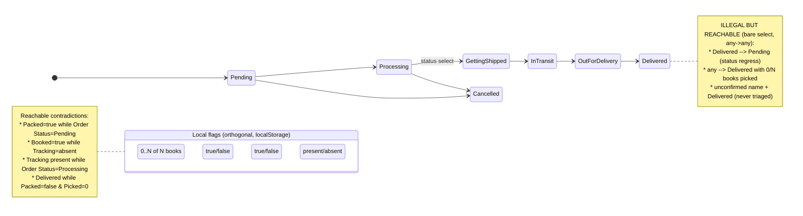

# Phase 0 — Repo Recon (Orders console)

Scope: the `/manage-orders` **Orders** experience (dashboard header, search+filters, stats, list, collapsed + expanded order card, pick/pack/book/track actions). No opinions here — facts + evidence only. Everything cites `path:line`. `EVIDENCE: not located` where I couldn't find it.

Note on filenames: line numbers are against `src/app/manage-orders/page.js` (**11,496 LOC**, one file) unless another path is given. A `page.js.bak` / `layout.js.bak` exist beside the live files — stale backups, ignored.

---

## 1. Screen & component inventory

The Orders experience is **not componentised** — it is one 11.5k-line client component plus a CSS file and an auth wrapper. There are no per-card / per-section components; everything is inline JSX inside `ManageOrders()`.

| Thing rendered | File | Responsibility | Rendered by | LOC (approx) |
|---|---|---|---|---|
| Whole console (all tabs) | `src/app/manage-orders/page.js` | Orders/Users/Analytics/Track/Tracking, all state + mutations | route | 11,496 |
| Auth gate | `src/app/manage-orders/layout.js:27` | wraps children in `<AdminLock pageName="Manage Orders">` | Next layout | 27 |
| Admin lock UI | `src/components/AdminLock.jsx` (`EVIDENCE: referenced at layout.js:2`, file not opened) | client-side unlock gate | layout | ? |
| Orders styles | `src/app/manage-orders/manage-orders-ui.css` + `src/app/globals.css` (`.mo-*`, `.orders-*`, `.um-*`, `.an2-*`) | card/list/stat styling | route | large |
| Sub-renders inside page.js | — | `OrdersLoader()` skeleton `:1671`; `Accordion()` `:1597`; `WalletModal()` `:534`; analytics cells `:692/:901` | self | — |
| Write helpers (shared) | `src/utils/googleFormOrder.js:89` `updateOrderRow` (duplicate of the page-local one) | sheet writes | imported | — |
| Book cover lookup | `src/utils/book.js` via `getBookImage` (page-local map) | title → cover image | self | — |

**Finding F0-A (structural):** a single 11.5k-line file holds ~119 `useState` hooks (`grep -c useState` = 119) and every mutation. This is the root cause behind most sequencing/testing constraints in later phases. Confidence: high.

---

## 2. State model — as it actually exists

Every order carries **8 parallel status dimensions**. Only 2 are persisted to the sheet; **6 are device-local (`localStorage`)** and therefore invisible to a second packer or a page reload on another device.

| Dimension | Values | Stored where | Persisted? | Who/what mutates it | UI that mutates | Derived? |
|---|---|---|---|---|---|---|
| Order status | Pending / Processing / Getting Shipped / In Transit / Out for Delivery / Delivered / Cancelled (`TRACK_STATUS_OPTIONS`) | Sheet col `Order Status` | ✅ sheet | operator | collapsed card `<select>` `:8973`; expanded `<select>` (2nd copy); queued via `pendingStatus`, pushed `pushPendingStatus:3357` | persisted |
| Pick (per book) | `{ "orderId::idx": true }` | `localStorage manage_orders_picks` `:3724` | ❌ local only | operator | tap a cover `toggleBook:3755` | persisted local |
| Packed | `{ orderId: true }` | `localStorage manage_orders_packed` `:3726` | ❌ local only | operator | `togglePacked:3745` ("Mark as packed") | persisted local |
| Booked (courier) | `{ orderId: true }` | `localStorage mo_booked_orders` `:2872` | ❌ local only | operator | `markOrderBooked:2886` after Book-online flow | persisted local |
| Tracking / Shipping ID | string | Sheet col `Shipping ID` | ✅ sheet | operator | per-row input + `saveTrackingId:5362`; bulk `pushTrackingRows` | persisted |
| Confirmed / unconfirmed | boolean | **derived** from `Customer Name` containing `"(unconfirmed)"` | n/a | merchant confirm page (not this screen) | none here | **derived** |
| Payment mode | COD / UPI / WhatsApp | Sheet col `Payment Type` | ✅ sheet | at checkout | none here | persisted |
| Comment / note | string | Sheet col `Comment` **and** `localStorage mo_order_notes` `:2853` | mixed | operator | note editor `:9118` | both |

**Finding F0-B (data-loss class):** pick, packed, booked, and internal notes live only in `localStorage`. Two people packing the same day, or the same person on a second device/after a cache clear, see **zero shared progress**. `EVIDENCE: manage_orders_picks:3724, manage_orders_packed:3726, mo_booked_orders:2872, mo_order_notes:2853`. Confidence: high. This is the single most important finding.

---

## 3. The real state machine (incl. illegal-but-reachable states)

The `Order Status` control is a **bare `<select>` with all options always enabled** (`:8973`, `:8931` maps `TRACK_STATUS_OPTIONS` unconditionally). No transition is forbidden. The 6 local dimensions are fully orthogonal to it. So the machine below is *permissive by construction*.

**Highest-value illegal states (all reachable today, none blocked):**

| # | Illegal state | How reached | Risk | Evidence |
|---|---|---|---|---|
| I1 | `Delivered` with 0 books picked | pick is local + optional; status is free select | mis-ship / lie to customer | `toggleBook:3755` independent of status `:8973` |
| I2 | Status regresses (`Delivered → Pending`) | select has no guard | corrupt audit trail | `:8931` all options enabled |
| I3 | Marked `Booked`/`Packed` but `Order Status=Pending` | orthogonal local flags | operator confusion, double-work | `togglePacked:3745`, `markOrderBooked:2886` |
| I4 | Ships an **unconfirmed** order | no triage step in this list | ships unpaid/unverified order | confirmed = derived; no confirm CTA here |
| I5 | Ships at **negative margin** (`-₹152, 5.9%`) | margin shown, never blocked | loses money silently | `pnl` computed `:3809`, only displayed |

---

## 4. Data contract

`fetchOrders` reads the **entire sheet** via gviz and maps **every column dynamically** into `order[header]` (`:3810–3811`, headers from `data.table.cols`). So the order object = all sheet columns + these derived fields (`:3797–3810`):

`parsedBooks` (`[{name,quantity,price,total}]` via `parseBooksList`), `shippingId`, `status`, `revenue` (`parseFloat Total Amount`), `booksCost`, `weight`, `deliveryCost`, `totalCost`, `pnl`, `_rowIndex`.

Sheet columns the UI reads: `Order ID, Customer Name, Phone Number, Address, City, State, Pincode, Books List, Total Amount, Payment Type, Delivery Type, Order Status, Shipping ID, TinyURL, Comment, Order Comment, Timestamp, Timestamp(D), Gift Wrap, Gift Wrap Charge, Delivery Charge, Wallet, Offer Applied`.

| Field | Shown | Hidden | Truncated | Derived |
|---|---|---|---|---|
| Customer Name | ✅ header | | ✅ CSS ellipsis (`Zikra (unconfir…`) | |
| Order ID | ✅ (last-3 highlighted `mo-oid-hl`) | | ✅ (`OR…` mid) | |
| Phone | ✅ + copy | | | |
| Books (title/qty/price) | ✅ covers | | ✅ title clamp | qty/price parsed |
| Revenue/Cost/**Profit** | ✅ inline (expanded) | | | ✅ from catalogue cost |
| Address / maps URL | ✅ raw | | | maps URL inline in text |
| State | ✅ (often empty `—`) | | | |
| Confirmed | | ✅ (only via name tag) | | ✅ |

**Finding F0-C:** `Cost` and `Profit` are rendered inline in the expanded card during picking (`pnl:3809`, shown in screenshot 2). Sensitive commercial data on the packing screen. Confidence: high (rendered), cost/impact = hypothesis.

---

## 5. Interaction audit (collapsed + expanded card)

Legend: **Conf?** = shows a confirm · **Undo?** = reversible · **Idem?** = safe to double-tap.

| Element | Action | Labelled | ~Target | Conf? | Undo? | Idem? | Evidence |
|---|---|---|---|---|---|---|---|
| Card body / name | expand/collapse (or select in select-mode) | text | large | — | yes | yes | `:8796` |
| Phone copy | copy to clipboard | icon-only | ~24px | — | n/a | yes | `:8830` |
| Order-ID copy | copy | icon-only | ~24px | — | n/a | yes | `:8858` |
| **View** link | open `/profile/{n}/orders/{id}` new tab | text | ok | — | n/a | yes | `mo-view-link:8875` |
| Today chip | none (display) | text | — | — | — | — | `:8892` |
| Pay pill | none (display) | text | — | — | — | — | `:8904` |
| Chevron | expand | icon-only | ~24px | — | yes | yes | `:8948` |
| Amount | expand | text | ok | — | yes | yes | `mo-amount:8965` |
| **Status select** | queue status change (persisted) | native select | ok | **no** | queue only (Discard) | last-write | `:8973`, push `:3357` |
| **WhatsApp** | open wa.me picker | icon-only | 38px | no | n/a | **no (double-opens)** | `mo-wa-btn`, `openWhatsApp:102` |
| **Delete** | delete row from sheet | icon-only, red | ~30px | **yes** `window.confirm:5435` | **no** | no (`no-cors:5444`) | `:8985` |
| Cover (per book) | toggle picked | image | ~72px | — | yes | yes | `toggleBook:3755` |
| Comment | open note editor | text | ok | — | yes | yes | `:9134` |
| Book online | open India-Post sheet | text | ok | — | n/a | — | `:9149` |
| (expanded) Revenue/Cost/Profit | display, 3 full-width cards | text | — | — | — | — | screenshot 2 |
| (expanded) Status select **(2nd copy)** | same as collapsed | native select | ok | no | queue | — | expanded body |
| (expanded) Mark as packed | toggle local packed | text | ok | — | yes (toggle) | yes | `togglePacked:3745` |
| (expanded) Tracking input + **Save** | write `Shipping ID` | placeholder-labelled | ok | — | overwrite | last-write | `saveTrackingId:5362` |
| (expanded) Copy / Copy JSON / Edit | 3 address affordances | text | ok | — | — | — | screenshot 3 |
| (expanded) **Order …link** (2nd link) | duplicate of View | text | ok | — | — | — | screenshot 2/3 |

**Key interaction findings**
- **F0-D:** all sheet writes go through `mode:"no-cors"` (`updateOrderRow:5329`, `appendOrderRow:5344`, `deleteOrderRow:5444`). The `fetch` resolves **opaquely**, so a server-side failure (500, quota, bad deploy) **cannot be detected**. `saveTrackingId:5362` and `deleteOrderRow` have `try/catch` + `alert`, but those only fire on a network-layer throw, never on an HTTP error. Optimistic UI + 1300 ms re-fetch is the only reconciliation. On 3G this is a silent mis-write / mis-ship class. Confidence: high.
- **F0-E:** `pushPendingStatus:3357` swallows per-order errors (`.catch(console.error)`) then **clears the whole queue unconditionally** (`setPendingStatus({})` in `finally`). A failed status push is dropped silently with no retry and no surfaced failure. Confidence: high.
- **F0-F:** WhatsApp (`openWhatsApp:102`) is a bare `window.open(wa.me…)` — no sent/failed/last-sent state, no dedupe → double-tap = two message drafts. Confidence: high.
- **F0-G:** delete **does** confirm (`window.confirm:5435`) → **REJECTS** the seed "no confirm". But: no undo, red icon at same weight as WhatsApp, `no-cors` (can't confirm success). Confidence: high.

---

## 6. Perf & resilience baseline

| Aspect | Reality | Evidence |
|---|---|---|
| Fetch model | Reads the **entire order history** each visit via one gviz call, parsed client-side | `SHEET_API_URL` fetch `:3812`; no `where`/date scoping |
| Payload for 100 orders | `EVIDENCE: not measured`. Grows with **all-time** rows, not today's. Cheapest verify: log `text.length` at `:3813` | hypothesis |
| List rendering | Incremental batches of **10** via IntersectionObserver (`ORDERS_BATCH=10:2746`, `visibleOrders=slice(0,ordersVisible):5873`, observer bumps `:6039`) + "Load more" `:9703` | — |
| Virtualisation | **None** — rendered cards stay in the DOM; 200 orders ⇒ 200 heavy cards (covers, selects) accumulate | no windowing lib |
| Book covers | `` (`:9031`), no width/height, no `srcset`, decode on scroll | `:9031` |
| Failed fetch | `catch(error){ console.error } finally { setLoading(false) }` → **no error UI**; screen falls to empty/`No orders found:9715` | `:3894` |
| Offline | **No handling.** Optimistic writes queue nothing; reload loses in-flight | — |
| Double-tap | Delete not idempotent (row match); WhatsApp double-opens; status = last-write-wins | above |
| Loading state | `OrdersLoader()` skeleton `:6048` (good) | — |
| Empty state | `"No orders found":9715` exists (good) | — |
| Error state | **Absent** for fetch and for all `no-cors` writes | — |
| Auth | Client-side `AdminLock` wrapper `layout.js:27`; but `SHEET_EDIT_API_URL` (write/delete `/exec`) is **hardcoded in the client bundle** `:258` and the full-sheet read URL is client-side | `layout.js:27`, `:258` |

---

## 7. Seed observations — verified against code

| Seed | Verdict | Evidence / correction |
|---|---|---|
| Name & Order ID truncate | **CONFIRMED** | CSS ellipsis on `.mo-name` / order id; both are identity fields |
| Order-ID last-3 in different colour, undocumented | **CONFIRMED** | `mo-oid-hl:8854` |
| Book titles truncate; search placeholder truncates | **CONFIRMED** (titles) / **PARTIAL** (placeholder = container width, not code) | `.mo-cover-name` clamp |
| Index `1,2` re-number on sort | **CONFIRMED** | `idx+1:8815`, idx is list position |
| Three parallel state systems (status / pick / packed) | **CONFIRMED — understated.** There are **8** (§2), 6 of them local | §2 |
| unconfirmed sits in list, no triage | **CONFIRMED** | derived from name; no confirm CTA in this view |
| Trash beside WhatsApp, **no confirm, no undo** | **PARTIAL / REJECTED** | confirm **exists** `:5435`; no undo TRUE; `no-cors` silent-fail TRUE |
| Status change is a bare dropdown, may silently mutate/fail | **CONFIRMED** | `:8973`, push swallows errors `:3357` |
| Green means 3 things; amber 2; red 2 | **CONFIRMED** | revenue/profit/UPI all green; amber=Processing pill + primary btn; red=neg-margin + delete |
| Stats block ≈ full viewport before first order | **CONFIRMED** | 4 stat cards + accordion header before card 1 (screenshot 1) |
| Revenue/Cost/Profit = 3 stacked full-width cards | **CONFIRMED** | screenshot 2 |
| No sticky order header in expanded card | **CONFIRMED** | `EVIDENCE: no sticky positioning on card header` |
| `0/16 picked` is plain text, not primary progress | **CONFIRMED** | `.orders-picked-stat` text `:8297` |
| "Picking is order-level only, no per-book tick" | **REJECTED** | per-book tick **exists** (`toggleBook:3755`, tap cover). BUT: no per-unit qty pick, **no cross-order pick list**, no shelf/author grouping — those are TRUE gaps |
| Book online: no rate compare / in-flight / failure | **PARTIAL** | opens a booking sheet (`setBookOrder`); `EVIDENCE: rate compare not located`; failure/in-flight = verify in that sheet |
| Tracking: free text, low-contrast Save, no validation/carrier/scan | **CONFIRMED (mostly)** | free text + amber Save; there **is** a per-row saving state `rowSaving:5366`; no format/carrier/scan |
| WhatsApp: no preview/sent state/history; double-tap double-messages | **CONFIRMED** | `openWhatsApp:102` |
| Address unstructured, maps URL inline, STATE empty, 3 copy affordances | **CONFIRMED** | screenshot 3; `Copy/Copy JSON/Edit` |
| Cost/margin exposed inline mid-pick | **CONFIRMED** | `pnl` shown expanded |
| Neg-margin shown but not flagged/blocked | **CONFIRMED** | only displayed |
| Order link twice; status control twice; "Standard Delivery (Standard Delivery)"; Today + long date coexist | **CONFIRMED** | View `:8875` + expanded "Order…link"; two status selects; duplicated delivery string; `Today` chip + `25th Aug…` |
| Tabs+Filters+sort+grid/list+Select+2 kebabs in one strip | **CONFIRMED** | `:8301` toolbar cluster + tab row |
| Icon-only buttons lack names / 44px / focus | **PARTIAL** | many icon-only (copy/trash/WA/chevron); some have `title` but not `aria-label`; targets < 44px (§5); contrast = verify |
| No empty/loading/error/offline states | **PARTIAL / REJECTED** | loading `:6048` + empty `:9715` **exist**; **error + offline absent** (S1) |

---

## 8. What is genuinely good (must survive)

- Incremental batch render + IntersectionObserver + "Load more" (`:6039/:9703`) — keep.
- `OrdersLoader` skeleton (`:6048`) and empty state (`:9715`) — keep, extend to error/offline.
- Per-book pick by tapping the cover (`toggleBook:3755`) — the interaction is right; the *model* (local-only, no cross-order list) is what's broken.
- Queued status edits with a single **Push** + **Discard** (`pushPendingStatus/discardPendingStatus`) — batching intent is correct; it just needs real success/failure.
- Delete **has** a confirm (`:5435`).
- Copy affordances on phone + order id (`:8830/:8858`).

---

## Blocking questions (≤7 — answer before Phase 1 conclusions harden)

1. **Source of truth for pick/pack/book:** is `localStorage`-only intentional (single operator, single phone), or must these sync to the sheet / be visible to a second packer? This flips F0-B from S3 to S1.
2. **Concurrency:** can two people ever have `/manage-orders` open at once (two phones, or phone + desktop)? Determines whether we need server-side pick/pack state and conflict handling.
3. **`no-cors` writes:** is the Apps Script `/exec` returning CORS headers we could switch to `cors` mode to read success/failure — or is `no-cors` a hard constraint? This gates every "reliable write" fix.
4. **Confirm step:** is there any server rule preventing shipping an **unconfirmed** or **negative-margin** order, or is the operator the only guard? Determines if I1/I4/I5 become hard blocks or just warnings.
5. **Volume reality:** you said 60–200/day — how many **total** rows are in the sheet now (the fetch reads all-time)? This sets the perf ceiling and whether date-scoping the read is Slice 1.
6. **Courier scope:** is "Book online" always **India Post**, or multi-carrier? Affects tracking-ID validation, carrier inference, and the rate-compare ask.
7. **Do NOT touch list:** anything in this screen that is load-bearing for a workflow I can't see (e.g., the two kebab menus, `Select` bulk mode, the Track/Tracking tabs) that must not change behaviour in a redesign?

---
*Phase 0 complete. No opinions ranked yet, no code changed. On your answers to the 7 above, I proceed to Phase 1 (pain-point register).*
